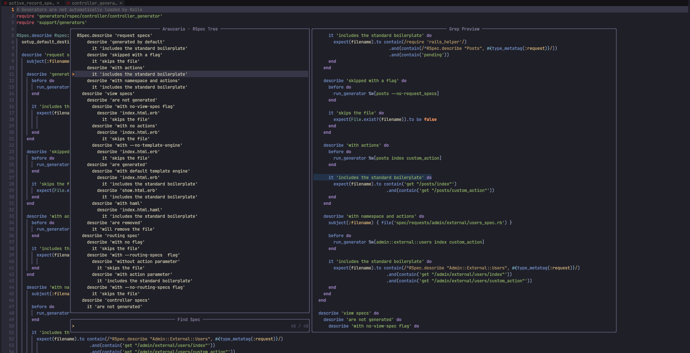
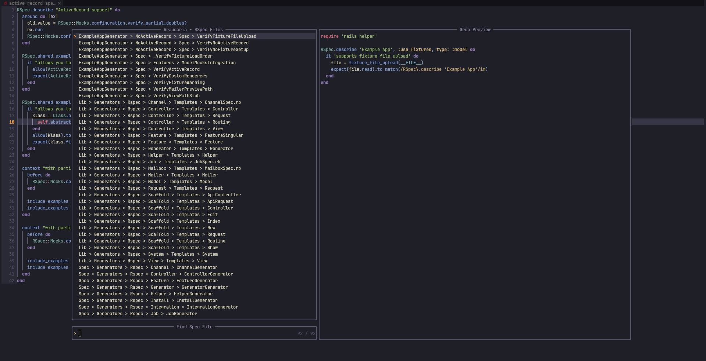

# Araucaria

Araucaria is a Neovim plugin to navigate through RSpec files.

## Installation

Use your favorite plugin manager to install `Araucaria`. For example, with Lazy.vim:

```lua
  'rufex/araucaria.nvim',
  dependencies = {
    'nvim-treesitter/nvim-treesitter',
    'nvim-telescope/telescope.nvim',
    'nvim-lua/plenary.nvim'
  },
```

## How to use

Araucaria provides two commands:

- :AraucariaBuff - Opens a Telescope picker to show all RSpec tests for the provided buffer or current buffer if not specified.
- :AraucariaAll - Opens a Telescope picker to show all RSpec files in the project.
- :Araucaria - Combines the functionality of :AraucariaBuff and :AraucariaAll:
  - If the current buffer is an RSpec file, it behaves like `:AraucariaBuff`.
  - If the current buffer is not an RSpec file, it behaves like `:AraucariaAll`, and after selecting an RSpec file, it opens that file's RSpec tests as `ArucariaBuff`.

## Screenshots

### `:Araucaria`



### `:AraucariaAll`



## Roadmap

- [ ] FZF ?

## [Araucaria](https://en.m.wikipedia.org/wiki/Araucaria)


[Image by Dangelin5 - Own work, CC BY-SA 4.0](https://commons.wikimedia.org/w/index.php?curid=57620752)
